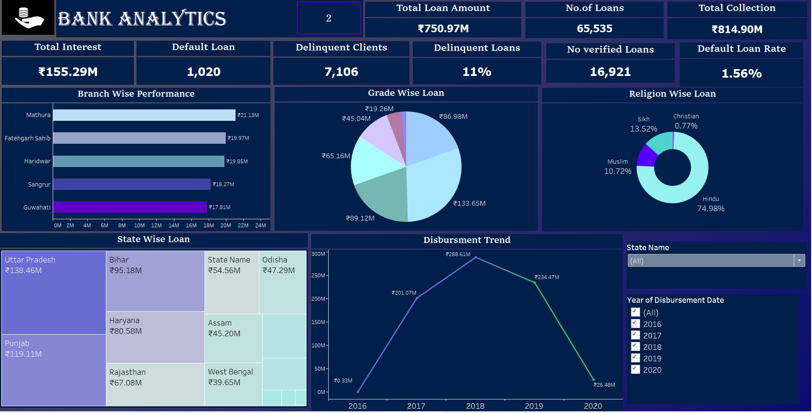
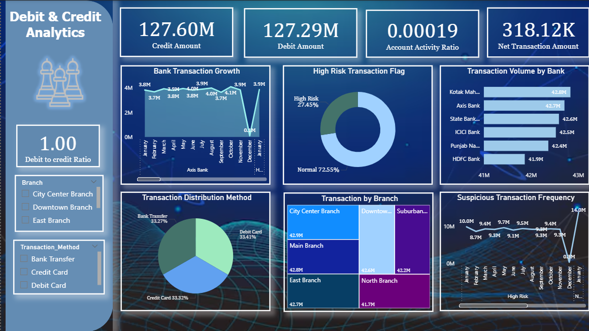

## 📊 Bank Loan Portfolio Dashboard
This dashboard provides a comprehensive visual analysis of a bank’s loan portfolio performance across multiple dimensions — including interest collections, default rates, client delinquency, loan disbursement trends, and demographic distributions.

---

### 🔹 Overview
**Title:** **BANK ANALYTICS**  
The dashboard focuses on tracking and understanding **loan performance**, client behavior, and geographic distributions to support data-driven decision-making for financial institutions.

---

### 📌 Key Metrics (Top Row)

| Metric                    | Value       | Description                                                                 |
|---------------------------|-------------|-----------------------------------------------------------------------------|
| **Total Loan Amount**     | ₹750.97M    | Total value of loans issued by the bank.                                   |
| **Total Interest**        | ₹155.29M    | Cumulative interest earned on all loans.                                   |
| **Total Collection**      | ₹814.90M    | Total repayment received (includes principal + interest).                  |
| **No. of Loans**          | 65,535      | Total number of loans issued.                                              |
| **Delinquent Clients**    | 7,106       | Number of clients who have overdue loans.                                  |
| **Delinquent Loans**      | 11%         | Percentage of loans in default status.                                     |
| **Default Loan**          | 1,020       | Total number of defaulted loans.                                           |
| **Default Loan Rate**     | 1.56%       | Proportion of total loans that have defaulted.                             |
| **No Verified Loans**     | 16,921      | Loans lacking proper verification or documentation.                        |
| **Unlabeled Box ("2")**   | (Unspecified) | Possibly a placeholder or count of selected filters.                        |

---

### 📍 Visuals & Analysis

#### 1. **Branch Wise Performance (Bar Chart)**  
Highlights the top 5 performing branches based on total disbursed loan amounts:
- **Top Branch:** Mathura (₹21.13M)
- Other significant branches: Fatehgarh Sahib, Haridwar, Sangrur, Guwahati.

#### 2. **Grade Wise Loan Distribution (Pie Chart)**  
Categorizes loan distribution based on credit or loan grades (likely internal bank ratings).  
- Largest segment: ₹133.65M
- Others range from ₹19.26M to ₹89.12M.

#### 3. **Religion Wise Loan (Donut Chart)**  
Breakdown of loans by borrower religion:
- **Hindu:** 74.98%
- **Muslim:** 10.72%
- **Sikh:** 13.52%
- **Christian:** 0.77%

This view gives insight into demographic outreach and inclusivity.

#### 4. **State Wise Loan (Treemap)**  
Visual comparison of loan amounts across Indian states.  
- **Top State:** Uttar Pradesh (₹138.46M)
- Others include Punjab (₹119.11M), Bihar (₹95.18M), and Haryana (₹80.58M).

#### 5. **Disbursement Trend (Line Chart)**  
Tracks the year-wise disbursement volume from 2016 to 2020:
- Peak in 2018 (₹288.61M)
- Sharp decline in 2020 (₹26.48M), likely due to external factors such as economic downturns or COVID-19 impact.

#### 6. **Filters (Right Panel)**  
- **State Name Dropdown:** Enables drill-down by selected states.
- **Year of Disbursement Date (Checklist):** Multi-year filter for trend comparison and temporal insights.

---

### 🧠 Conclusion

This dashboard provides a **holistic view** of the bank’s loan operations.  
From performance metrics and client segmentation to regional analytics and disbursement trends, it empowers stakeholders to:

- Identify high-performing branches and states  
- Monitor delinquency and default risk  
- Understand demographic reach  
- Track yearly disbursement behavior  

The interactive filters allow for tailored analysis based on location and time, making it a powerful tool for both strategic and operational decisions.

---

### 🛠 Built With

- **Tool:** Tableau / Power BI (based on design elements)
- **Data Sources:** Bank loan records, client demographic info, disbursement logs

---

### 🖼️ Dashboard Preview

> _A visual representation of the bank loan analytics dashboard, showcasing loan metrics, trends, and demographic insights._

## 💳 Debit & Credit Transaction Dashboard

This dashboard offers a comprehensive view of debit and credit transaction activity across different banks, branches, and methods. It also provides insights into account behavior, transaction risks, and frequency anomalies to support fraud detection and financial transparency.

---

### 🔹 Overview

**Title:** **DEBIT & CREDIT ANALYTICS**  
The dashboard focuses on understanding **transaction patterns**, **branch performance**, and **risk flags** across the banking system. It provides real-time visibility into transaction types, frequency, and volume distribution, helping stakeholders maintain financial control and detect anomalies.

---

### 📌 Key Metrics (Top Row)

| Metric                     | Value       | Description                                                                 |
|----------------------------|-------------|-----------------------------------------------------------------------------|
| **Credit Amount**          | ₹127.60M    | Total credited amount across accounts.                                      |
| **Debit Amount**           | ₹127.29M    | Total debited amount from accounts.                                         |
| **Account Activity Ratio** | 0.00019     | Indicates the transaction frequency per account — lower ratio may flag inactivity or risk. |
| **Net Transaction Amount** | ₹318.12K    | Total value of net transactions (credits minus debits or balance shift).    |
| **Debit to Credit Ratio**  | 1.00        | Indicates balanced transactional behavior between debit and credit flows.   |

---

### 📍 Visuals & Analysis

#### 1. **Bank Transaction Growth (Line Chart)**  
Monthly transaction growth over the year:
- Fairly stable between 3.7M and 4.1M from Jan to Nov.
- **Notable anomaly:** Sudden drop to 0.1M in December and sharp recovery in January — suggests irregular system behavior or high-risk event.

#### 2. **High Risk Transaction Flag (Donut Chart)**  
- **High Risk Transactions:** 27.45%  
- **Normal Transactions:** 72.55%  
This metric helps evaluate the percentage of flagged suspicious activity versus normal transactions.

#### 3. **Transaction Volume by Bank (Bar Chart)**  
Compares volume handled by major banks:
- **Top Performers:**  
  - Kotak Mahindra: ₹42.8M  
  - Axis Bank: ₹42.7M  
  - SBI, ICICI, PNB — all close in range  
  - HDFC Bank: ₹41.9M

#### 4. **Transaction by Branch (Treemap)**  
Highlights transaction values by branches:
- All branches hover around the ₹42M mark — including City Center, Main, Downtown, East, Suburban, and North.
- Reflects consistent distribution of transactions across operational areas.

#### 5. **Transaction Distribution Method (Pie Chart)**  
Breakdown by payment mode:
- **Debit Card:** 33.41%  
- **Credit Card:** 33.32%  
- **Bank Transfer:** 33.27%  
Near-perfect balance shows even distribution of transaction methods — indicating broad consumer behavior patterns.

#### 6. **Suspicious Transaction Frequency (Line Chart)**  
Visualizes monthly trend of flagged/suspicious activity:
- Consistent values around 9.3M–10M throughout the year.
- **Major spike in December (14M)** followed by a drop in January — may signal system alerts, fraudulent activity, or internal reviews.

---

### 🎛 Filters (Left Panel)

- **Branch Selector:** Filter by City Center, Downtown, East Branch, etc.  
- **Transaction Method Selector:** Choose between Bank Transfer, Credit Card, Debit Card

These filters allow users to isolate patterns within specific branches or transaction types.

---

### 🧠 Conclusion

This dashboard delivers key insights into **transaction health, risk detection, and operational consistency**. It enables banks and analysts to:

- Track real-time debit/credit volume  
- Flag potential high-risk or unusual activity  
- Analyze trends by method, branch, and bank  
- Maintain a balanced transactional ecosystem  

Anomalies and risk ratios are clearly flagged for timely action, making this dashboard essential for fraud prevention and operational monitoring.

---

### 🛠 Built With

- **Tool:** Tableau / Power BI  
- **Data Sources:** Transaction logs, fraud detection systems, account metadata

---

### 🖼️ Dashboard Preview

> _An interactive dashboard analyzing debit-credit balance, high-risk transactions, and volume distribution across banks and branches._

